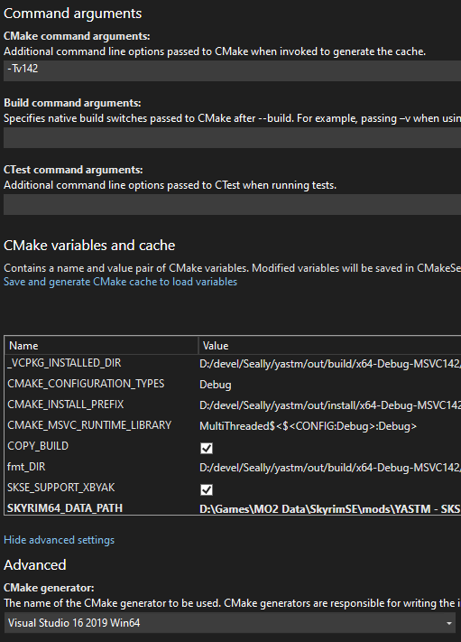

# YASTM SKSE Plugin

This plugin implements the SKSE portion of the YASTM (Yet Another Soul Gem
Manager) mod for Skyrim Special Edition.

It completely overrides the soul trap logic used by the game, so Papyrus code
can simply call `caster.TrapSoul(victim)` and it should work as long as all
supporting TOMLs and ESPs are in place. Note that the changes made by USSEP to
`magicSoulTrapFXScript` must be reverted for this mod to operate as intended.

It also fixes the crash that occurs when using a reusable soul gem whose base
form already has a soul. In order for reusable soul gems to be supported by this
plugin, all non-empty reusable soul gems must have their NAM0 field (linked soul
gem) filled with their empty version.

This plugin has been written to be somewhat mod-agnostic and requires a
supporting ESP and configuration files to take advantage of its capabilities.
It does not hardcode soul gem and global variable form IDs, relying on
configuration files to provide this information.

Configuration examples have been provided in the `examples` folder. A reference
(and hopefully perfectly serviceable) implementation can be found
[here](https://github.com/Seally/yastm-ck).

## Building Requirements

* [CMake](https://cmake.org/)
* [Vcpkg](https://github.com/microsoft/vcpkg)
  * Add the environment variable `VCPKG_ROOT` with the value as the path to
    the folder containing Vcpkg.
* [Visual Studio Community 2019](https://visualstudio.microsoft.com/)
  * Desktop development with C++.
  * The project currently does not officially support any compilers other than
    MSVC. Everything is written with the assumption that MSVC is the compiler,
    especially because it is also the compiler used for Skyrim SE, hence the
    generated instructions should be more compatible with it.
* TOML Language Support: This is optional since one can live without
  highlighting and syntax checking since you probably won't be working with it
  much.

**Note #1:** Project is set up and catered for Visual Studio. Visual Studio
_Code_ should work, but seems to be occasionally buggy. Certain CMake variables
like `SKYRIM64_DATA_PATH` won't set when doing it from the interface so one
must do it manually, and sometimes it will refuse to find the correct library
paths.

CLion should work if you set it to target MSVC, but it's not tested.

**Note #2:** Any plugin that parses TOML must support at least v1.0 of the
specs. We use certain constructs that are only valid in v1.0+.

## Build Instructions

1. Install and set up dependencies.
   * The CMake script uses the `VCPKG_ROOT` environment variable to locate
     Vcpkg. Make sure this is set before starting your IDE. You may need to kill
     and restart `explorer.exe` for this to apply properly.
2. Clone the project _and_ its submodules using
   `git clone --recurse-submodules <repo_url>`.
3. Open the project in Visual Studio (preferred version: Visual Studio 2019).
4. Set CMake variables. See
   [Important CMake Variables](#important-cmake-variables) section for details.
5. Build the project.

### Using a Different Compiler Version

You can pick a different compiler version than the default in Visual Studio by
setting the following settings:

* Add `-Tv<msvc_version>` to CMake's command arguments.
* Use the Visual Studio generator instead of Ninja (otherwise it won't recognize
  the argument).

_Note:_ Within Visual Studio's UI, the generator configuration may be hidden
under advanced settings.

### Important CMake Variables

#### Required

* `SKSE_SUPPORT_XBYAK` - This option comes from CommonLibSSE and is required
  to be set to `ON` for the project to build.

#### Optional

* `COPY_BUILD` - Copies the built binaries to the appropriate folder after
  building.
* `SKYRIM64_DATA_PATH` - Set this to the path of Skyrim's Data folder. This
  should be filled if `COPY_BUILD` is `ON`.

  _Tip:_ You can also set this to the mod folder you're working on if you're
  using something like Mod Organizer 2.
